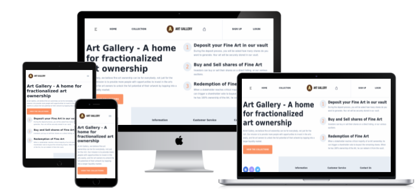
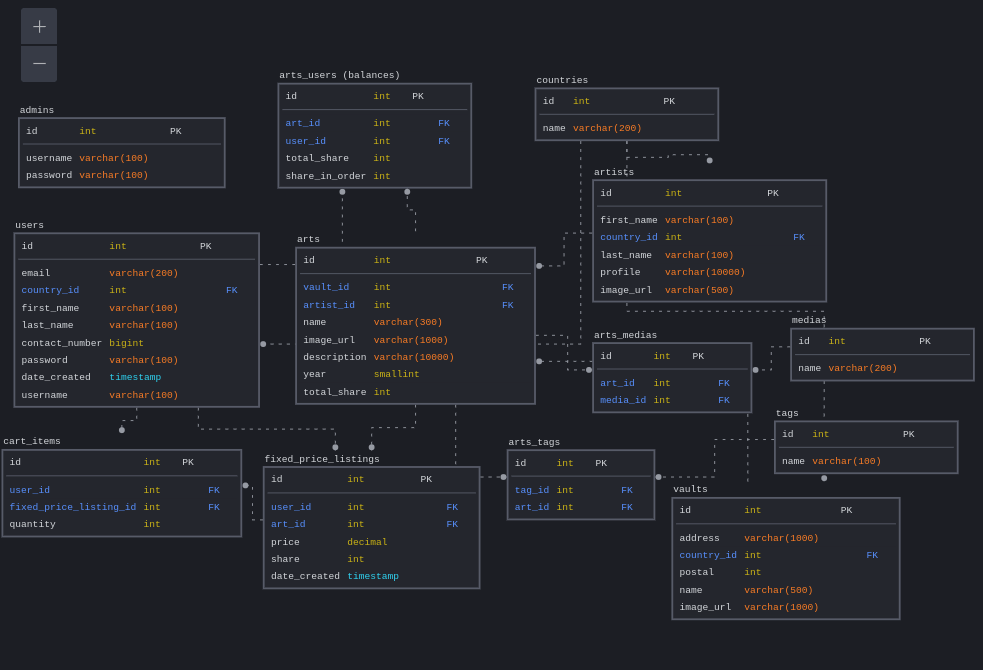
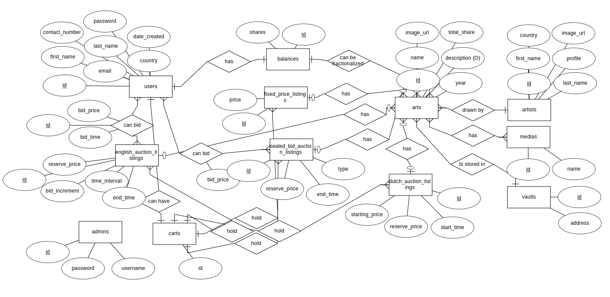

# TGC-16 Project 3

# Title: Art House

URL to deployed app: https://endearing-bombolone-6cf159.netlify.app/

User Login: tayboonsiang90@gmail.com

User Password: rotiprata123

API URL tp backend: https://tgc16-project3-express.herokuapp.com/api/

URL to backend admin panel: https://tgc16-project3-express.herokuapp.com/

Admin Login: root

Admin Password: password

## Summary

There is more potential in unlocking liquidity for traditionally illiquid items. This project will focus on making a marketplace for fine art. Art is illiquid due to high prices, lack of storage skills by owners and an absence of an online global marketplace. 

Art onboarding will be a two step process - Step 1: Physical Fine Art will be sent to a custodian, and the custodian will update the platform to state user has ownership of the Fine Art, Step 2: The art can be sold as a whole in an online marketplace, or the art can be fractionalized and sold in an in-house exchange. 

The redemption process will be simple - The current owner can go to the custodian to retrieve the fine art from the vault. However, if the art has been fractionalized, 100% ownership of the art shares must be proven. This process will be a buy-out offer price process by the majority stakeholder, put to vote and only passes if it meets quorum specified. 

In the online marketplace, 1 selling format is allowed for users - Fixed Price Listings, where a user can sell at a Fixed Price. 

The concepts for this project are easily portable to the blockchain, with concepts such as fractionalization and tokenization. 

# UX/UI

User Facing Side
Landing 
- Listing Detail (Fixed Price Listing)
Register
- (if success) Landing
- (if failure) Error Message

Balance

Your Listings

Cart

# FEATURES

User Authentication System
There must be a sign - up, login, logout system. 
Must be a secure process - CSRF, XSS protection, hashed passwords.

User
Any user can be a buyer or a seller.

# DATABASE SCHEMA

## Color Palette

The choice of color was primarily based on a light theme.

## Technologies Used

- HTML5
- CSS3
- JavaScript
- Bootstrap v5
- React
- Font Awesome
- Google Fonts
- Postgres
- Axios
- Express
- Cors
- Cloudinary
- Stripe
- Handlebars
- Knex
- Bookshelf ORM
- db-migrate

## Used in production
- Visual Studio Code
- Git
- GitHub
- Netlify
- Heroku

## Deployment
Hosted on Netlify free plan. To deploy, fork this code, and link your Github account with Netlify. Use the following settings: 

Base directory: Not set

Build command: CI=false npm run build

Publish directory: build

## CREDITS AND ACKNOWLEDGMENT
- Visual Studio Code
- Git
- GitHub
- Netlify
- HTML5
- CSS3
- JavaScript
- Bootstrap v5
- Font Awesome
- Google Fonts
- Leaflet
- Leaflet Marker Clustering
- Apex Charts
- Axios
- Last but not least, Trent Global College and their excellent teacher, Paul.
- Also my wife.
- And Family
